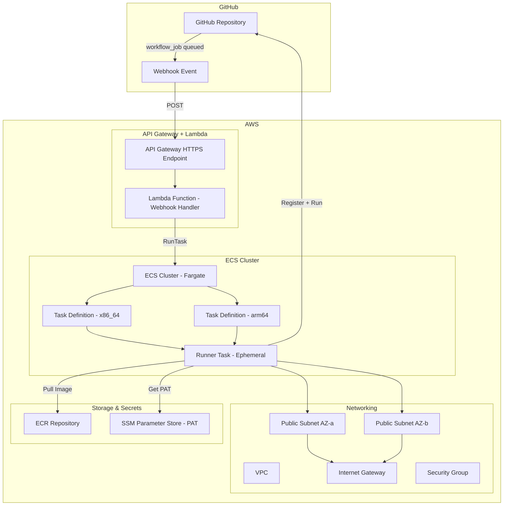
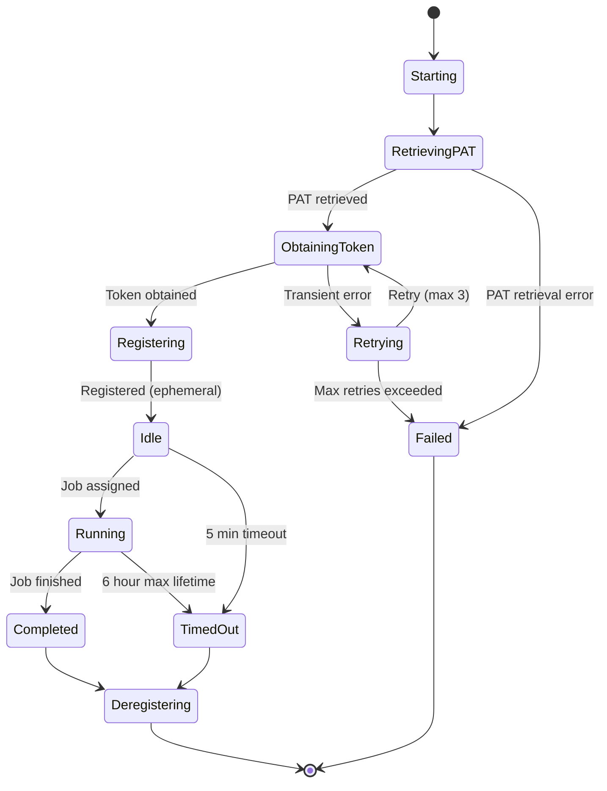

# Design Document

## Overview

This design describes the architecture for hosting GitHub self-hosted runners on AWS ECS with Fargate. The system receives GitHub `workflow_job` webhook events, determines the required architecture (x86_64 or arm64), and launches ephemeral Fargate tasks that register as GitHub runners, execute a single job, then terminate.

The infrastructure is defined entirely in CloudFormation. Supporting shell scripts handle image builds, ECR pushes, and stack lifecycle management. The webhook handler is implemented as an AWS Lambda function behind an API Gateway HTTPS endpoint.

### Key Design Decisions

1. **Lambda + API Gateway for webhook handling** — Serverless approach eliminates the need for a persistent webhook server, reduces cost, and scales automatically with incoming events.
2. **Separate Task Definitions per architecture** — Each architecture (x86_64, arm64) gets its own Task Definition to leverage Fargate's native multi-arch support via `runtimePlatform`.
3. **PAT stored in SSM Parameter Store (SecureString)** — Simpler than Secrets Manager for a single secret value, lower cost, and natively supported by ECS task definitions via `valueFrom`.
4. **Docker-in-Docker via Sysbox or buildx with QEMU** — Since Fargate doesn't support `--privileged`, we use rootless Docker or buildx with appropriate drivers for container builds within the runner.
5. **Single CloudFormation template** — All resources in one template for simplicity; the stack is small enough that nested stacks add unnecessary complexity.

## Architecture



### Request Flow

1. GitHub sends a `workflow_job` webhook event (action: `queued`) to the API Gateway endpoint.
2. API Gateway forwards the request to the Lambda webhook handler.
3. Lambda validates the webhook signature using the shared secret.
4. Lambda parses the payload, extracts runner labels, and determines the target architecture.
5. Lambda calls `ecs:RunTask` with the appropriate Task Definition and network configuration.
6. ECS launches a Fargate task in a public subnet with a public IP.
7. The runner container starts, retrieves the PAT from SSM, obtains a registration token from GitHub API.
8. The runner registers as ephemeral, picks up the queued job, executes it, then terminates.

## Components and Interfaces

### 1. CloudFormation Template (`cloudformation/template.yaml`)

Defines all AWS infrastructure resources:

| Resource            | Type                        | Purpose                   |
| ------------------- | --------------------------- | ------------------------- |
| VPC                 | `AWS::EC2::VPC`             | Network isolation         |
| PublicSubnetA/B     | `AWS::EC2::Subnet`          | Task placement across AZs |
| InternetGateway     | `AWS::EC2::InternetGateway` | Outbound internet access  |
| RouteTable + Route  | `AWS::EC2::Route`           | 0.0.0.0/0 → IGW           |
| SecurityGroup       | `AWS::EC2::SecurityGroup`   | Egress-only, no ingress   |
| ECSCluster          | `AWS::ECS::Cluster`         | Fargate capacity provider |
| TaskDefinitionX86   | `AWS::ECS::TaskDefinition`  | x86_64 runner config      |
| TaskDefinitionArm64 | `AWS::ECS::TaskDefinition`  | arm64 runner config       |
| TaskExecutionRole   | `AWS::IAM::Role`            | ECR pull + CW Logs        |
| TaskRole            | `AWS::IAM::Role`            | SSM read for PAT          |
| ECRRepository       | `AWS::ECR::Repository`      | Runner image storage      |
| SSMParameter        | `AWS::SSM::Parameter`       | PAT (SecureString)        |
| LambdaFunction      | `AWS::Lambda::Function`     | Webhook handler           |
| ApiGateway          | `AWS::ApiGatewayV2::Api`    | HTTPS endpoint            |
| WebhookSecret       | `AWS::SSM::Parameter`       | Webhook shared secret     |

**Parameters:**

- `StackName` — Stack identifier
- `PATValue` — GitHub PAT (NoEcho)
- `WebhookSecret` — GitHub webhook secret (NoEcho)
- `CpuAllocation` — Fargate CPU units (default: 2048)
- `MemoryAllocation` — Fargate memory MiB (default: 4096)
- `EphemeralStorage` — Ephemeral storage GiB (default: 30, min: 21)

### 2. Lambda Webhook Handler (`lambda/webhook_handler.py`)

Python Lambda function that processes GitHub webhook events.

**Interface:**

```python
def handler(event: APIGatewayProxyEvent, context: LambdaContext) -> APIGatewayProxyResponse:
    """
    Process GitHub workflow_job webhook events.

    Returns:
        200 - Task launched successfully
        400 - Malformed payload
        401 - Invalid signature
        422 - Unrecognized runner labels
        500 - ECS launch failure
    """
```

**Key Functions:**

```python
def validate_signature(payload: bytes, signature: str, secret: str) -> bool:
    """Validate GitHub webhook HMAC-SHA256 signature."""

def parse_labels(labels: list[str]) -> str | None:
    """
    Determine architecture from runner labels.
    Returns 'X86_64' | 'ARM64' | None
    """

def launch_task(cluster: str, task_def_arn: str, subnets: list[str],
                security_group: str) -> dict:
    """Launch an ECS Fargate task. Returns RunTask response."""
```

### 3. Runner Container Image (`docker/Dockerfile`)

Multi-stage Dockerfile for the runner image:

**Base layer:** Ubuntu 22.04
**Installed tools:** git, curl, jq, Docker CLI, buildx plugin
**Runner agent:** GitHub Actions runner (latest stable)
**Entrypoint:** `docker/entrypoint.sh`

### 4. Entrypoint Script (`docker/entrypoint.sh`)

Handles runner lifecycle within the container:

```bash
#!/bin/bash
# 1. Retrieve PAT from SSM Parameter Store
# 2. Obtain registration token from GitHub API (with retry)
# 3. Configure runner in ephemeral mode (--ephemeral)
# 4. Start runner agent
# 5. On completion/timeout: deregister and exit
```

**Environment Variables (from Task Definition):**

- `GITHUB_ORG` — GitHub organization name
- `GITHUB_REPO` — (Optional) Specific repository
- `PAT_SSM_PARAM` — SSM parameter name for PAT
- `RUNNER_LABELS` — Comma-separated runner labels
- `AWS_REGION` — AWS region for API calls

### 5. Build Scripts (`scripts/`)

| Script                     | Purpose                                       |
| -------------------------- | --------------------------------------------- |
| `scripts/build-image.sh`   | Build multi-arch runner image                 |
| `scripts/push-image.sh`    | Authenticate with ECR and push image          |
| `scripts/create-stack.sh`  | Validate and deploy CloudFormation stack      |
| `scripts/destroy-stack.sh` | Delete CloudFormation stack with confirmation |

## Data Models

### Webhook Payload (GitHub `workflow_job` event)

```json
{
  "action": "queued",
  "workflow_job": {
    "id": 123456789,
    "run_id": 987654321,
    "name": "build",
    "labels": ["self-hosted", "linux", "x64"],
    "runner_group_name": "Default"
  },
  "repository": {
    "full_name": "org/repo"
  },
  "organization": {
    "login": "org"
  }
}
```

### Architecture Label Mapping

| Label Pattern              | Architecture | Task Definition     |
| -------------------------- | ------------ | ------------------- |
| Contains "x64" or "x86_64" | X86_64       | TaskDefinitionX86   |
| Contains "arm64" or "arm"  | ARM64        | TaskDefinitionArm64 |
| No match                   | None         | Error (HTTP 422)    |

**Label matching rules:**

- Case-insensitive comparison
- Match against each label in the `labels` array
- First architecture match wins (if conflicting labels exist, x86_64 takes precedence)
- The label "self-hosted" and "linux" are ignored for architecture matching

### Task Definition Configuration

```json
{
  "family": "github-runner-{arch}",
  "runtimePlatform": {
    "cpuArchitecture": "X86_64 | ARM64",
    "operatingSystemFamily": "LINUX"
  },
  "cpu": "2048",
  "memory": "4096",
  "ephemeralStorage": { "sizeInGiB": 30 },
  "containerDefinitions": [
    {
      "name": "runner",
      "image": "{account}.dkr.ecr.{region}.amazonaws.com/github-runner:latest",
      "essential": true,
      "environment": [
        { "name": "GITHUB_ORG", "value": "..." },
        { "name": "RUNNER_LABELS", "value": "self-hosted,linux,{arch}" }
      ],
      "secrets": [{ "name": "GITHUB_PAT", "valueFrom": "/github-runner/pat" }],
      "logConfiguration": {
        "logDriver": "awslogs",
        "options": {
          "awslogs-group": "/ecs/github-runner",
          "awslogs-region": "{region}",
          "awslogs-stream-prefix": "runner"
        }
      }
    }
  ],
  "requiresCompatibilities": ["FARGATE"],
  "networkMode": "awsvpc"
}
```

### Runner Registration Flow State



## Correctness Properties

_A property is a characteristic or behavior that should hold true across all valid executions of a system — essentially, a formal statement about what the system should do. Properties serve as the bridge between human-readable specifications and machine-verifiable correctness guarantees._

The following properties apply to the webhook handler Lambda function, which contains the core logic amenable to property-based testing. Infrastructure (CloudFormation), shell scripts, and integration behaviors are validated through smoke tests, example-based tests, and integration tests respectively.

### Property 1: Label-to-architecture mapping correctness

_For any_ list of runner labels, if any label contains "x64" or "x86_64" (case-insensitive), `parse_labels` SHALL return "X86_64"; if any label contains "arm64" or "arm" (case-insensitive) and no x86 label is present, it SHALL return "ARM64"; if no label matches any architecture pattern, it SHALL return None.

**Validates: Requirements 2.3, 2.4, 2.6, 4.5, 4.6**

### Property 2: Webhook signature validation round-trip

_For any_ payload (arbitrary bytes) and any secret (non-empty string), computing the HMAC-SHA256 signature of the payload with the secret and then validating that signature with `validate_signature` SHALL return True. Conversely, for any payload and any signature that was NOT computed from that payload with the given secret, `validate_signature` SHALL return False.

**Validates: Requirements 4.3, 4.4**

### Property 3: Retry logic respects maximum attempts

_For any_ sequence of API responses where the first N responses are transient errors (N ≤ 3) followed by a success response, the retry function SHALL return success. For any sequence where more than 3 consecutive responses are transient errors, the retry function SHALL return failure regardless of subsequent responses.

**Validates: Requirements 3.7**

### Property 4: Payload validation accepts valid and rejects invalid payloads

_For any_ JSON object, if it contains the required fields (`action` = "queued", `workflow_job.labels` as a non-empty array, `repository.full_name` as a non-empty string), the payload validator SHALL accept it. For any JSON object missing any of these required fields or with incorrect types, the validator SHALL reject it.

**Validates: Requirements 4.8**

## Error Handling

### Webhook Handler Errors

| Error Condition                              | HTTP Status | Action                                                    |
| -------------------------------------------- | ----------- | --------------------------------------------------------- |
| Invalid/missing webhook signature            | 401         | Log attempt with source IP, reject request                |
| Malformed payload (missing fields, bad JSON) | 400         | Log validation error details, reject request              |
| Unrecognized architecture labels             | 422         | Log the unrecognized labels, reject request               |
| ECS RunTask API failure                      | 500         | Log error with AWS error code and message, return failure |
| Lambda timeout (approaching 30s limit)       | 500         | Log timeout warning, return failure                       |

### Runner Container Errors

| Error Condition                                | Exit Code | Action                                                                                          |
| ---------------------------------------------- | --------- | ----------------------------------------------------------------------------------------------- |
| PAT retrieval failure (SSM access denied)      | 1         | Log error with SSM parameter name, exit immediately                                             |
| PAT invalid/expired (GitHub 401)               | 1         | Log authentication error, exit immediately                                                      |
| Registration token retrieval transient error   | —         | Retry up to 3 times with 5s delay                                                               |
| Registration token retrieval permanent failure | 1         | Log error after retries exhausted, exit                                                         |
| Job timeout (5 min idle)                       | 0         | Deregister runner, exit cleanly                                                                 |
| Max lifetime exceeded (6 hours)                | 1         | Deregister runner, exit with timeout indicator                                                  |
| Docker daemon initialization failure           | 1         | Log Docker startup error, continue without Docker (runner still functional for non-Docker jobs) |

### Script Errors

| Script             | Error Condition             | Action                                                |
| ------------------ | --------------------------- | ----------------------------------------------------- |
| `create-stack.sh`  | Missing required parameter  | Display usage message, exit 1                         |
| `create-stack.sh`  | Template validation failure | Display validation errors, exit 1                     |
| `create-stack.sh`  | Stack creation failure      | Display stack events with failure reason, exit 1      |
| `destroy-stack.sh` | Stack not found             | Display error message, exit 1                         |
| `destroy-stack.sh` | Confirmation mismatch       | Display abort message, exit 0                         |
| `push-image.sh`    | ECR repository not found    | Display error indicating repo must be created, exit 1 |
| `push-image.sh`    | ECR authentication failure  | Display auth error, exit 1                            |

### Retry Strategy

The runner entrypoint implements a simple retry strategy for GitHub API calls:

```
Max retries: 3
Delay between retries: 5 seconds (fixed)
Retryable conditions: HTTP 5xx, connection timeout, DNS resolution failure
Non-retryable conditions: HTTP 401, HTTP 403, HTTP 404
```

## Testing Strategy

### Testing Approach

This feature uses a dual testing approach:

1. **Property-based tests** — Verify universal properties of the webhook handler's pure logic functions (label parsing, signature validation, payload validation, retry logic)
2. **Unit tests (example-based)** — Verify specific scenarios, error paths, and integration points
3. **Smoke tests** — Validate CloudFormation template structure and script existence
4. **Integration tests** — End-to-end verification of the deployed system

### Property-Based Tests

**Library:** [Hypothesis](https://hypothesis.readthedocs.io/) (Python, for Lambda handler logic)

**Configuration:**

- Minimum 100 iterations per property
- Each test tagged with design property reference

**Tests:**

| Test                                      | Property   | Tag                                                                                                    |
| ----------------------------------------- | ---------- | ------------------------------------------------------------------------------------------------------ |
| `test_label_parsing_architecture_mapping` | Property 1 | Feature: github-runners-ecs, Property 1: Label-to-architecture mapping correctness                     |
| `test_signature_validation_roundtrip`     | Property 2 | Feature: github-runners-ecs, Property 2: Webhook signature validation round-trip                       |
| `test_retry_logic_max_attempts`           | Property 3 | Feature: github-runners-ecs, Property 3: Retry logic respects maximum attempts                         |
| `test_payload_validation_completeness`    | Property 4 | Feature: github-runners-ecs, Property 4: Payload validation accepts valid and rejects invalid payloads |

### Unit Tests (Example-Based)

| Component       | Test                                          | Validates |
| --------------- | --------------------------------------------- | --------- |
| Webhook Handler | Valid queued event triggers RunTask call      | Req 4.2   |
| Webhook Handler | ECS failure returns 500 with error details    | Req 4.7   |
| Entrypoint      | Invalid PAT logs error and exits 1            | Req 3.5   |
| Entrypoint      | SSM access denied logs error and exits 1      | Req 3.6   |
| Entrypoint      | 5-minute idle timeout triggers deregistration | Req 8.5   |
| Build Script    | Image tagged with version and latest          | Req 6.3   |
| Build Script    | ECR auth called before push                   | Req 6.4   |
| Create Script   | Missing params shows usage and exits 1        | Req 7.7   |
| Destroy Script  | Non-existent stack shows error and exits 1    | Req 7.9   |
| Destroy Script  | Confirmation mismatch aborts deletion         | Req 7.4   |

### Smoke Tests (CloudFormation Template Validation)

| Test                                                    | Validates |
| ------------------------------------------------------- | --------- |
| Template contains ECS Cluster with Fargate provider     | Req 1.1   |
| Template contains VPC with 2+ public subnets            | Req 1.2   |
| Template contains security group with egress-only rules | Req 1.4   |
| Template contains x86_64 Task Definition                | Req 2.1   |
| Template contains arm64 Task Definition                 | Req 2.2   |
| Template contains ephemeral storage ≥ 20 GiB            | Req 5.6   |
| Template contains SSM parameter for PAT                 | Req 3.1   |
| Entrypoint script includes --ephemeral flag             | Req 8.1   |
| Task definition has no persistent volume mounts         | Req 8.3   |

### Integration Tests

| Test                                                      | Validates    |
| --------------------------------------------------------- | ------------ |
| Deploy stack and verify all resources created             | Req 1.x      |
| Send webhook event, verify task launches in public subnet | Req 1.3, 4.2 |
| Runner registers with GitHub and appears in runner list   | Req 3.3      |
| Runner completes job and deregisters                      | Req 3.4, 8.2 |
| Docker build succeeds inside runner task                  | Req 5.2      |
| Runner image available for both architectures             | Req 2.5      |

### Test Directory Structure

```
tests/
├── unit/
│   ├── test_webhook_handler.py      # Lambda handler unit tests
│   ├── test_label_parser.py         # Label parsing logic
│   └── test_entrypoint.sh           # Shell script tests (bats)
├── property/
│   ├── test_label_parsing_props.py  # Property 1
│   ├── test_signature_props.py      # Property 2
│   ├── test_retry_props.py          # Property 3
│   └── test_payload_props.py        # Property 4
├── smoke/
│   └── test_template_validation.py  # CloudFormation template checks
└── integration/
    └── test_e2e.py                  # End-to-end deployed system tests
```
