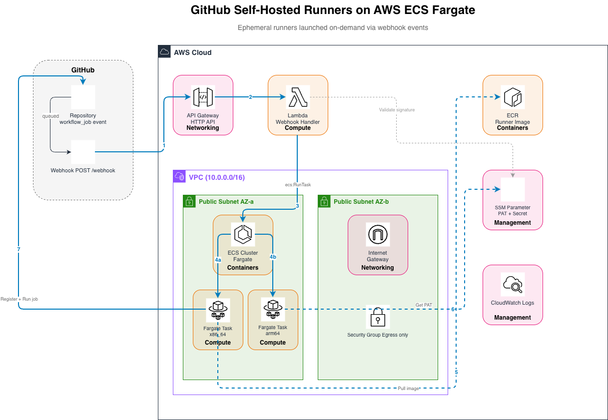
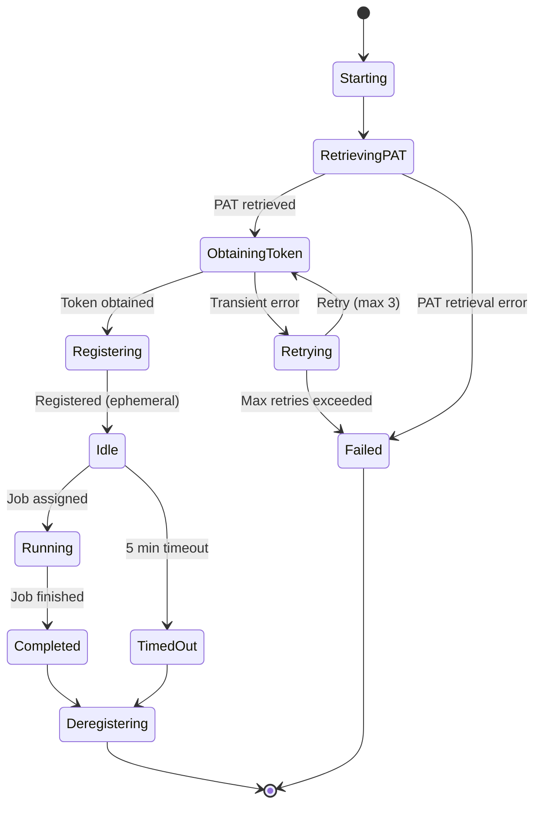

# GitHub Self-Hosted Runners on AWS ECS (Fargate)

Ephemeral GitHub Actions self-hosted runners running on AWS ECS with Fargate. The system automatically launches a fresh runner container for each workflow job, executes it, and terminates — no persistent infrastructure, no stale state.

## Architecture



> The source diagram is at `docs/architecture.drawio` — open it in [draw.io](https://app.diagrams.net/) or VS Code with the Draw.io Integration extension to edit.

### Request Flow

1. GitHub sends a `workflow_job` webhook (action: `queued`) to the API Gateway endpoint.
2. Lambda validates the HMAC-SHA256 signature, parses the payload, and determines the architecture from `runs-on` labels.
3. Lambda calls `ecs:RunTask` with the matching task definition (x86_64 or arm64).
4. The Fargate task starts, retrieves the PAT from SSM, obtains a registration token, and registers as an ephemeral runner.
5. The runner picks up the queued job, executes it, deregisters, and the task terminates.

### Runner Lifecycle



## Prerequisites

- AWS CLI v2 configured with credentials
- Docker with buildx support (for multi-arch builds)
- A GitHub Personal Access Token (PAT) with `admin:org` scope (or `repo` scope for repo-level runners)
- Python 3.12+ (for local development/testing)

## Project Structure

```
├── cloudformation/
│   └── template.yaml          # All AWS infrastructure (single stack)
├── docker/
│   ├── Dockerfile             # Multi-arch runner image (Ubuntu 22.04 + Kaniko)
│   ├── entrypoint.sh          # Runner lifecycle: register → run → deregister
│   └── retry.py               # Retry logic module (used by property tests)
├── docs/
│   └── architecture.drawio    # AWS architecture diagram
├── lambda/
│   └── webhook_handler.py     # Webhook processing Lambda function
├── scripts/
│   ├── build-image.sh         # Build and push multi-arch Docker image
│   ├── create-stack.sh        # Deploy CloudFormation stack
│   ├── destroy-stack.sh       # Tear down stack with confirmation
│   └── validate_yaml.py       # CloudFormation template validator (dev utility)
├── tests/
│   ├── unit/                  # Example-based unit tests
│   ├── property/              # Property-based tests (Hypothesis)
│   ├── smoke/                 # CloudFormation template validation
│   └── integration/           # End-to-end webhook flow tests
├── CHANGELOG.md
├── LICENSE
├── README.md
├── requirements.txt           # Lambda runtime dependencies
└── requirements-dev.txt       # Test dependencies
```

## Quick Start

### 1. Create a GitHub PAT

Generate a Personal Access Token (classic) at [github.com/settings/tokens](https://github.com/settings/tokens):

- **Org-level runners**: Select the `admin:org` scope
- **Repo-level runners**: Select the `repo` scope

> **Note:** Fine-grained PATs have limited support for self-hosted runner registration. The classic token is the straightforward option. For production, consider a [GitHub App](https://docs.github.com/en/actions/tutorials/use-actions-runner-controller/authenticate-to-the-api) which provides short-lived tokens and granular permissions.

### 2. Generate a Webhook Secret

```bash
openssl rand -hex 20
```

Save this value — you'll use it for both the stack deployment and the GitHub webhook configuration.

### 3. Deploy the Infrastructure

**For a personal account (repo-level runners):**

```bash
./scripts/create-stack.sh \
  --stack-name github-runners \
  --region us-east-1 \
  --pat ghp_YOUR_PAT_HERE \
  --webhook-secret YOUR_SECRET_HERE \
  --github-org your-username \
  --github-repo your-repo-name
```

**For an organization (org-level runners):**

```bash
./scripts/create-stack.sh \
  --stack-name github-runners \
  --region us-east-1 \
  --pat ghp_YOUR_PAT_HERE \
  --webhook-secret YOUR_SECRET_HERE \
  --github-org your-org-name
```

Optional parameters:

| Flag              | Default | Description                                            |
| ----------------- | ------- | ------------------------------------------------------ |
| `--update`        | —       | Update an existing stack instead of creating a new one |
| `--github-repo`   | (empty) | Repo name for repo-level runners; omit for org-level   |
| `--task-role-arn` | (empty) | ARN of a custom IAM role for runner tasks (see below)  |
| `--cpu`           | 2048    | Fargate CPU units (256, 512, 1024, 2048, 4096)         |
| `--memory`        | 4096    | Memory in MiB                                          |
| `--storage`       | 30      | Ephemeral storage in GiB (min 21)                      |

The script validates the template, packages the Lambda code, deploys the stack, and waits for completion. On success it prints the **Webhook Endpoint URL** — you'll need this next.

To update an existing stack (e.g., after changing the template or parameters):

```bash
./scripts/create-stack.sh --update \
  --stack-name github-runners \
  --region us-east-1 \
  --pat ghp_YOUR_PAT_HERE \
  --webhook-secret YOUR_SECRET_HERE \
  --github-org your-org-name
```

### 4. Build and Push the Runner Image

```bash
# Build multi-arch (amd64 + arm64) and push directly to ECR
./scripts/build-image.sh v1.0.0 \
  123456789012.dkr.ecr.us-east-1.amazonaws.com/github-runner \
  us-east-1
```

The script authenticates with ECR, builds for both platforms, and pushes the image in one step. The ECR repo URI is in the stack outputs.

To build locally without pushing (for testing):

```bash
./scripts/build-image.sh v1.0.0
```

### 5. Configure the GitHub Webhook

1. Go to your GitHub organization: **Settings → Webhooks → Add webhook**
2. Set:
   - **Payload URL**: The API Gateway URL from the stack output (e.g., `https://abc123.execute-api.us-east-1.amazonaws.com/webhook`)
   - **Content type**: `application/json`
   - **Secret**: The same webhook secret you used during deployment
   - **Events**: Select "Workflow jobs" only
3. Save the webhook.

## Integrating a Repository

To use these self-hosted runners in any repository within your organization:

### Workflow Configuration

In your repository's `.github/workflows/*.yml`, set `runs-on` to target the runner labels:

```yaml
name: CI

on: [push, pull_request]

jobs:
  build-x86:
    runs-on: [self-hosted, linux, x64]
    steps:
      - uses: actions/checkout@v4
      - run: echo "Running on x86_64 ECS Fargate runner"

  build-arm:
    runs-on: [self-hosted, linux, arm64]
    steps:
      - uses: actions/checkout@v4
      - run: echo "Running on arm64 ECS Fargate runner"
```

### Supported Labels

The system routes jobs based on architecture labels in `runs-on`:

| Label             | Architecture | Task Definition         |
| ----------------- | ------------ | ----------------------- |
| `x64` or `x86_64` | X86_64       | 2 vCPU / 4 GB (default) |
| `arm64` or `arm`  | ARM64        | 2 vCPU / 4 GB (default) |

- Label matching is **case-insensitive**
- `self-hosted` and `linux` are required by GitHub but ignored for routing
- If conflicting labels exist (both x64 and arm64), **x86_64 takes precedence**
- If no architecture label matches, the webhook returns HTTP 422 and no runner is launched

### Docker Builds Inside Runners

The runner image includes [Kaniko](https://github.com/chainguard-dev/kaniko) (Chainguard fork) for building container images without a Docker daemon — which is required on Fargate since it doesn't support privileged mode.

> **Important:** Kaniko must run with `sudo` because it needs root to unpack base image layers. The `--force` flag is required since Kaniko runs inside the runner image rather than as its own container.

**Build and push to ECR:**

```yaml
jobs:
  docker-build:
    runs-on: [self-hosted, linux, x64]
    steps:
      - uses: actions/checkout@v4
      - name: Build and push image with Kaniko
        run: |
          sudo -E /kaniko/executor \
            --context ${{ github.workspace }} \
            --dockerfile Dockerfile \
            --destination ${{ secrets.ECR_REPO_URI }}:${{ github.sha }} \
            --destination ${{ secrets.ECR_REPO_URI }}:latest \
            --force
```

**Build without pushing (validation only):**

```yaml
- name: Build image (no push)
  run: |
    sudo -E /kaniko/executor \
      --context ${{ github.workspace }} \
      --dockerfile Dockerfile \
      --no-push \
      --force
```

Kaniko authenticates to ECR via a Docker config JSON you generate in your workflow (see [Kaniko Gotchas](#kaniko-gotchas-and-workflow-tips) below for details).

> **Note:** `docker build` and `docker run` commands will NOT work on these runners since there's no Docker daemon. Use Kaniko for image builds.

### Repo-Level Runners (Personal Accounts)

By default, if `--github-repo` is provided during deployment, runners register at the repository level using the endpoint `/repos/{owner}/{repo}/actions/runners/registration-token`. This is the correct setup for personal GitHub accounts that don't have an organization.

If `--github-repo` is omitted, runners register at the organization level.

### Custom Task Role (AWS Permissions for Workflows)

By default, runner tasks only have permission to read the PAT from SSM. If your workflows need to call AWS services (ECR, S3, STS, etc.), create an IAM role with the required permissions and pass it during deployment:

```bash
./scripts/create-stack.sh \
  --stack-name github-runners \
  --region us-east-1 \
  --pat ghp_xxx \
  --webhook-secret xxx \
  --github-org your-org \
  --task-role-arn arn:aws:iam::123456789012:role/my-runner-task-role
```

The custom role must have a trust policy allowing `ecs-tasks.amazonaws.com` to assume it:

```json
{
  "Version": "2012-10-17",
  "Statement": [
    {
      "Effect": "Allow",
      "Principal": { "Service": "ecs-tasks.amazonaws.com" },
      "Action": "sts:AssumeRole"
    }
  ]
}
```

> **Important:** Your custom task role **must** include `secretsmanager:GetSecretValue` for the PAT secret. The entrypoint calls `aws secretsmanager get-secret-value` at runtime to obtain the registration token. Without this permission, the runner will fail immediately on startup.

Example policy for workflows that build and push Docker images to ECR:

```json
{
  "Version": "2012-10-17",
  "Statement": [
    {
      "Effect": "Allow",
      "Action": ["ecr:GetAuthorizationToken"],
      "Resource": "*"
    },
    {
      "Effect": "Allow",
      "Action": [
        "ecr:BatchCheckLayerAvailability",
        "ecr:GetDownloadUrlForLayer",
        "ecr:BatchGetImage",
        "ecr:InitiateLayerUpload",
        "ecr:UploadLayerPart",
        "ecr:CompleteLayerUpload",
        "ecr:PutImage"
      ],
      "Resource": "arn:aws:ecr:*:123456789012:repository/*"
    },
    {
      "Effect": "Allow",
      "Action": ["sts:GetCallerIdentity"],
      "Resource": "*"
    },
    {
      "Effect": "Allow",
      "Action": ["secretsmanager:GetSecretValue"],
      "Resource": "arn:aws:secretsmanager:*:123456789012:secret:/github-runner/pat*"
    }
  ]
}
```

## Configuration Reference

### CloudFormation Parameters

| Parameter          | Required | Default | Description                                                       |
| ------------------ | -------- | ------- | ----------------------------------------------------------------- |
| `GitHubOrg`        | Yes      | —       | GitHub organization or username                                   |
| `GitHubRepo`       | No       | (empty) | Repository name for repo-level runners; leave empty for org-level |
| `PATValue`         | Yes      | —       | GitHub PAT (stored in SSM)                                        |
| `WebhookSecret`    | Yes      | —       | Webhook HMAC secret (stored in SSM)                               |
| `TaskRoleArn`      | No       | (empty) | Custom IAM role ARN for runner tasks (grants workflow AWS access) |
| `CpuAllocation`    | No       | 2048    | Fargate CPU units                                                 |
| `MemoryAllocation` | No       | 4096    | Memory in MiB                                                     |
| `EphemeralStorage` | No       | 30      | Ephemeral disk in GiB (min 21)                                    |

### Runner Environment Variables

These are set automatically by the task definition:

| Variable         | Description                                            |
| ---------------- | ------------------------------------------------------ |
| `GITHUB_ORG`     | Organization or username for runner registration       |
| `GITHUB_REPO`    | (Optional) Repository name for repo-level registration |
| `PAT_SECRET_ARN` | Secrets Manager ARN for the PAT                        |
| `RUNNER_LABELS`  | Labels assigned to the runner                          |
| `AWS_REGION`     | Region for AWS API calls                               |

## Operations

### Updating the Runner Image

```bash
./scripts/build-image.sh v1.1.0 \
  123456789012.dkr.ecr.us-east-1.amazonaws.com/github-runner \
  us-east-1
```

New tasks will automatically pull the `latest` tag. Running tasks are unaffected (ephemeral — they terminate after one job).

### Rotating the PAT

Update the secret in Secrets Manager:

```bash
aws secretsmanager put-secret-value \
  --secret-id /github-runner/pat \
  --secret-string "ghp_NEW_TOKEN_HERE" \
  --region us-east-1
```

New runner tasks will pick up the updated PAT immediately.

### Monitoring

- **CloudWatch Logs**: Runner output is streamed to `/ecs/github-runner` log group
- **ECS Console**: View running/stopped tasks in the cluster
- **GitHub UI**: Check runner status at Organization → Settings → Actions → Runners

### Destroying the Stack

```bash
./scripts/destroy-stack.sh --stack-name github-runners --region us-east-1
```

You'll be prompted to type the stack name to confirm. This deletes all resources including the VPC, ECS cluster, ECR repository, and stored secrets.

## Runner Lifecycle

Each runner task follows the state machine shown in the architecture diagram above:

1. **Start** — Fargate launches the container
2. **Retrieve PAT** — Fetches the token from SSM Parameter Store
3. **Register** — Obtains a registration token from GitHub API (retries up to 3× on transient errors)
4. **Configure** — Registers as an ephemeral runner (`--ephemeral` flag)
5. **Wait** — Waits for a job assignment (5-minute idle timeout)
6. **Execute** — Runs the assigned workflow job
7. **Terminate** — Deregisters from GitHub and the Fargate task stops

If no job arrives within 5 minutes, the runner deregisters and exits cleanly.

## Testing with the Demo Repository

A demo repository is available at [alegon-apps/demo-nginx-cicd](https://github.com/alegon-apps/demo-nginx-cicd) to verify the runner infrastructure end-to-end.

### What it does

The demo repo contains a minimal nginx Dockerfile and a GitHub Actions workflow that builds the image on both architectures (`x64` and `arm64`) using the self-hosted ECS runners.

### Steps to test

1. **Ensure the stack is deployed** and the webhook is configured (see [Quick Start](#quick-start)).

2. **Fork or push to the demo repo:**

   ```bash
   git clone https://github.com/alegon-apps/demo-nginx-cicd.git
   cd demo-nginx-cicd
   # Make any change (e.g., edit html/index.html)
   git commit -am "trigger build" && git push
   ```

3. **Observe the workflow** at https://github.com/alegon-apps/demo-nginx-cicd/actions — you should see two jobs (`build-x86` and `build-arm`) picked up by ECS runners.

4. **Verify in AWS:**
   - ECS console → cluster → check that tasks were launched and completed
   - CloudWatch Logs → `/ecs/github-runner` → confirm runner registered, executed, and deregistered

### Expected workflow file

The demo uses this workflow (`.github/workflows/build.yml`):

```yaml
name: Build Nginx Image

on:
  push:
    branches: [main]
  pull_request:
    branches: [main]

jobs:
  build-x86:
    runs-on: [self-hosted, linux, x64]
    steps:
      - uses: actions/checkout@v4
      - name: Build image with Kaniko
        run: |
          sudo /kaniko/executor \
            --context ${{ github.workspace }} \
            --dockerfile Dockerfile \
            --no-push \
            --force

  build-arm:
    runs-on: [self-hosted, linux, arm64]
    steps:
      - uses: actions/checkout@v4
      - name: Build image with Kaniko
        run: |
          sudo /kaniko/executor \
            --context ${{ github.workspace }} \
            --dockerfile Dockerfile \
            --no-push \
            --force
```

If both jobs complete successfully, the self-hosted runner infrastructure is working correctly.

## Development

### Running Tests

```bash
pip install -r requirements-dev.txt
python -m pytest tests/ -v
```

Test categories:

- `tests/unit/` — Unit tests for handler, scripts, and entrypoint logic
- `tests/property/` — Property-based tests (Hypothesis) for core logic invariants
- `tests/smoke/` — CloudFormation template structure validation
- `tests/integration/` — End-to-end webhook flow with mocked AWS services

### Local Lambda Testing

```bash
# Run just the webhook handler tests
python -m pytest tests/unit/test_webhook_handler.py -v

# Run property tests with verbose Hypothesis output
python -m pytest tests/property/ -v --hypothesis-show-statistics
```

## Kaniko Gotchas and Workflow Tips

Kaniko runs inside the runner container (not in its own isolated container), which introduces some quirks. Here's what to watch out for:

### ECR Authentication for Kaniko

Kaniko doesn't use `docker login`. You need to generate a Docker config JSON manually in your workflow:

```yaml
- name: Configure ECR auth for Kaniko
  run: |
    TOKEN=$(aws ecr get-login-password --region ${AWS_REGION})
    AUTH=$(echo -n "AWS:${TOKEN}" | base64 -w 0)
    sudo mkdir -p /kaniko/.docker
    echo "{\"auths\":{\"${ECR_REGISTRY}\":{\"auth\":\"${AUTH}\"}}}" | sudo tee /kaniko/.docker/config.json
```

### Running Kaniko

- Use `sudo -E` to preserve environment variables (ECS metadata endpoint for IAM credentials)
- Don't use `--docker-cfg` — it doesn't exist in this version. Kaniko reads `/kaniko/.docker/config.json` by default
- Always use `--force` since Kaniko is running inside another container

```yaml
- name: Build and push
  run: |
    sudo -E /kaniko/executor \
      --context ${{ github.workspace }} \
      --dockerfile Dockerfile \
      --destination ${ECR_REPO}:latest \
      --force
```

### Host Filesystem Leakage

Kaniko's biggest gotcha when running inside a container is that it snapshots the host's filesystem as the base layer. Host-specific files (dpkg overrides, config files, system groups) leak into the build and conflict with the target image's packages.

Fix this at the start of your Dockerfile's `RUN` commands:

```dockerfile
RUN rm -f /var/lib/dpkg/statoverride && \
    rm -f /etc/X11/Xsession.d/90gpg-agent && \
    apt-get update && apt-get install -y ...
```

### Missing Packages on Self-Hosted Runners

Unlike GitHub-hosted runners, self-hosted runners don't come with many pre-installed tools. Common additions needed in your workflow:

```yaml
- name: Install dependencies
  run: sudo apt-get update && sudo apt-get install -y python3-venv
```

### Non-Interactive Builds

Always set `DEBIAN_FRONTEND=noninteractive` in Dockerfiles built with Kaniko — there's no TTY, so interactive prompts (like dpkg conffile questions) will hang forever:

```dockerfile
ENV DEBIAN_FRONTEND=noninteractive
```

## Security Considerations

- **No inbound traffic**: Security group allows egress only — runners cannot be reached from the internet
- **Ephemeral by design**: Each job gets a fresh container with no state from previous runs
- **Secrets in Secrets Manager**: PAT and webhook secret are stored in AWS Secrets Manager with KMS encryption, never in code or environment variables at rest
- **Webhook validation**: Every incoming request is verified via HMAC-SHA256 before processing
- **Non-root execution**: The runner agent runs as a non-root user inside the container
- **Minimal IAM**: Task role only has `ssm:GetParameter` for the PAT; execution role only has ECR pull and CloudWatch Logs

## License

[MIT](LICENSE)
